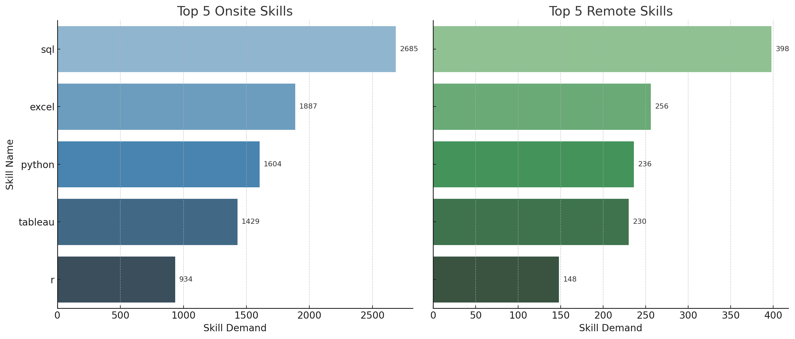

# Introduction
 📊 Project Introduction: Job Postings 2023
This project analyzes job postings data from 2023 to uncover key trends in hiring, skills demand, work formats, and employment types. Using structured SQL methods—such as joins, subqueries, and aggregations—it transforms raw data into clear, actionable insights, offering a sharp view of the evolving job market.
 
- SQL queries. check them out here; [first_practice_by_my_own](/first_practice_by_my_own/questions.sql).

# Background
The world of work is evolving—fast. With the rise of remote roles, tech-driven hiring, and shifting skill demands, 2023 marked a pivotal year in the job market. This project dives into real job postings to decode what employers truly value today. By analyzing thousands of listings with SQL, we uncover the trends shaping modern careers—from the hottest roles to the skills that open doors.
### The questions I aim to answer through my SQL queries;
1. What are the top 10 most in-demand skills for Data Analysts, based on current job market trends?

2. Which skills are most commonly required for Data Analyst jobs by work location (Remote vs Onsite)?

3. What are the top 10 highest-paying Data Analyst roles by average annual salary?

4. How do companies differ in their degree requirements when hiring Data Analysts, and what is the distribution of these roles?

5. Which companies are hiring the most Data Analysts globally, and how are their job postings distributed between remote and onsite roles?

6. Which skills are most commonly required for the highest-paying Data Analyst roles in both remote and city-based jobs?

# Tools & Technologies Used
- **SQL:** Core tool for data exploration, quality checks, and generating insights.
- **postgreSQL:** I used PostgreSQL for managing and storing the 2023 job postings dataset, enabling efficient querying and analysis throughout the project.
- **visual studio code** I used VS Code over pgAdmin for advanced SQL development and project management, thanks to its flexibility, extensions, and Git integration.
- **Git&github** Used for version control and project sharing, allowing collaboration and tracking of changes throughout development.
# The analysis
 Each SQL query in this project is designed to investigate a specific aspect of the dataset, with clear logic and purpose behind every analysis step.

 Here’s the approach I took to tackle the analysis effectively.
 ### Q1:What are the top 10 most in-demand skills for Data Analysts, based on current job market trends?. 

 This reveals the most valued technical skills for data analysts, helping job seekers and educators prioritize what matters in today’s job market.
  ```sql 
 SELECT 
    skills_dim.skills,
    COUNT(*) AS skill_demand
FROM job_postings_fact
JOIN skills_job_dim ON job_postings_fact.job_id = skills_job_dim.job_id
JOIN skills_dim ON skills_job_dim.skill_id = skills_dim.skill_id
WHERE job_postings_fact.job_title_short = 'Data Analyst'
  AND job_postings_fact.salary_year_avg IS NOT NULL
  AND job_postings_fact.salary_year_avg > 0
GROUP BY skills_dim.skills
ORDER BY skill_demand DESC
LIMIT 10;
 ```
 ### Result Table: Top 10 In-Demand Skills for Data Analysts.

| Skill        | Job Postings Count |
|--------------|--------------------|
| SQL          | 3083               |
| Excel        | 2143               |
| Python       | 1840               |
| Tableau      | 1659               |
| R            | 1073               |
| Power BI     | 1044               |
| SAS          | 1000               |
| Word         | 527                |
| PowerPoint   | 524                |
| SQL Server   | 336                |


Here is the bar chart showing the Top 10 Most In-Demand Skills for Data Analysts, based on job postings with salary data.

# Key Findings & Insights

SQL is the top skill demanded, followed by Excel, Python, and Tableau. BI and database tools like Power BI, SAS, and SQL Server remain important, along with communication tools such as Word and PowerPoint.

# Q2:Which skills are most commonly required for Data Analyst jobs by work location (Remote vs Onsite)?.

Based on globally sourced job postings, this analysis compares the most in-demand technical skills for Onsite and Remote Data Analyst roles. The findings highlight how skill priorities differ by work setting, offering actionable insights for career growth and hiring.

``` sql
SELECT *
FROM (
    SELECT 
        skills_dim.skills AS skill_name,
        CASE 
            WHEN job_postings_fact.job_location = 'Anywhere' THEN 'Remote'
            ELSE 'Onsite'
        END AS location_type,
        COUNT(*) AS skill_demand,
        ROW_NUMBER() OVER (
            PARTITION BY 
                CASE 
                    WHEN job_postings_fact.job_location = 'Anywhere' THEN 'Remote'
                    ELSE 'Onsite'
                END
            ORDER BY COUNT(*) DESC
        ) AS rank
    FROM job_postings_fact
    JOIN skills_job_dim ON job_postings_fact.job_id = skills_job_dim.job_id
    JOIN skills_dim ON skills_job_dim.skill_id = skills_dim.skill_id
    WHERE job_postings_fact.job_title_short = 'Data Analyst'
      AND job_postings_fact.salary_year_avg IS NOT NULL
      AND job_postings_fact.salary_year_avg > 0
    GROUP BY 
        skills_dim.skills,
        CASE 
            WHEN job_postings_fact.job_location = 'Anywhere' THEN 'Remote'
            ELSE 'Onsite'
        END
) ranked
WHERE rank <= 5
ORDER BY location_type, skill_demand DESC;
```

Side-by-side comparison of top skills for Onsite vs Remote Data Analyst roles, highlighting demand differences by location type.

# Key Findings & Insights

- SQL is the most in-demand skill for both Onsite and Remote roles, with Onsite demand (2685) far exceeding Remote (398).

- Excel, Python, and Tableau consistently rank in the top 5 for both categories, highlighting their universal value in data analysis roles.

- Power BI appears exclusively in Onsite roles, while R is specific to Remote roles — indicating differing tool preferences by work environment.

In general, Onsite roles show higher demand across all top skills, which may reflect a greater volume of Onsite postings or broader skill expectations.

# Q3: What are the top 10 highest-paying Data Analyst roles by average annual salary?.
In the competitive job market of 2023, compensation for Data Analyst roles varied significantly by company and seniority level. By analyzing job postings from that year containing “Data Analyst” in the title and including reported average annual salaries, we identified the highest-paying positions and the organizations offering them.
```sql 
SELECT 
    job_title,
    name AS company_name,
    MAX(salary_year_avg) AS salary_year_avg
FROM job_postings_fact
JOIN company_dim ON job_postings_fact.company_id = company_dim.company_id
WHERE 
    job_title ILIKE '%data analyst%'
    AND salary_year_avg IS NOT NULL
GROUP BY job_title, name
ORDER BY salary_year_avg DESC
LIMIT 10;
```
# Result table of highest-paying Data Analyst roles (2023)
To keep this section concise, I’ve included only the top 5 roles in the table below. However, the full list of 10 highest-paying roles is visualized in the accompanying bar chart for complete context.
| Rank | Job Title                | Company                      | Salary (USD) |
| ---- | ------------------------ | ---------------------------- | ------------ |
| 1    | Data Analyst             | Mantys                       | \$650,000    |
| 2    | Senior Data Analyst SME  | Modern Tech Solutions        | \$375,000    |
| 3    | Sr Data Analyst          | Illuminate Mission Solutions | \$375,000    |
| 4    | Data Analyst             | Anthropic                    | \$350,000    |
| 5    | Quant Analyst (Contract) | Eden Smith Group             | \$340,000    |

Other high-paying roles from GradBay, TikTok, Walmart, and Pinterest (salaries $230K–$240K) are reflected in the chart above.


Here is the bar chart visualizing the Top 10 Highest-Paying Data Analyst Roles by average annual salary. 
# Key Findings & Insights
- Outlier Salary: Mantys offers $650K for a Data Analyst role — far above market, likely due to unique responsibilities or equity.
- Defense Sector Premiums: Modern Technology Solutions and Illuminate Mission Solutions pay $375K+, reflecting high compensation in secure/government-aligned roles.

- AI-Driven Demand: Anthropic offers $350K, highlighting strong pay for analysts in advanced tech and AI sectors.

- Title ≠ Salary: High-paying roles at Mantys and Anthropic show that “Senior” isn’t always tied to compensation.

- Tech Giants Compete:TikTok, Pinterest, and Walmart offer $230K+, underscoring strong demand for analytics in top tech firms.
# Q4: How do companies differ in their degree requirements when hiring Data Analysts, and what is the distribution of these roles?.
 
Demand for Data Analysts is soaring, but degree expectations differ. Some firms now hire on skills alone, while others still insist on a formal degree.
```sql
SELECT 
    company_dim.name AS company_name,
    CASE 
        WHEN job_no_degree_mention = TRUE THEN 'No Degree Required'
        WHEN job_no_degree_mention = FALSE THEN 'Degree Required'
        ELSE 'Not Mentioned'
    END AS degree_requirement,
    COUNT(*) AS job_postings_count
FROM job_postings_fact
JOIN company_dim ON job_postings_fact.company_id = company_dim.company_id
WHERE job_title_short = 'Data Analyst'
GROUP BY company_dim.name, 
         CASE 
            WHEN job_no_degree_mention = TRUE THEN 'No Degree Required'
            WHEN job_no_degree_mention = FALSE THEN 'Degree Required'
            ELSE 'Not Mentioned'
         END
HAVING COUNT(*) >= 3
ORDER BY job_postings_count DESC
LIMIT 10;
```
# Result Table
Here’s the enhanced table including percentages of each company’s postings by degree requirement, for better insight:
| Company             | Degree Requirement | Job Postings Count | % of Total Postings per Company\* |
| ------------------- | ------------------ | ------------------ | --------------------------------- |
| Citi                | Degree Required    | 804                | 100%                              |
| Robert Half         | No Degree Required | 667                | 100%                              |
| Emprego             | Degree Required    | 571                | 51.8%                             |
| Emprego             | No Degree Required | 550                | 48.2%                             |
| UnitedHealth Group  | Degree Required    | 515                | 100%                              |
| Insight Global      | No Degree Required | 457                | 51.4%                             |
| Insight Global      | Degree Required    | 435                | 48.6%                             |
| Get It Recruit - IT | Degree Required    | 448                | 100%                              |
| Corporate           | Degree Required    | 415                | 100%                              |
| SynergisticIT       | Degree Required    | 399                | 100%                              |

Percentages calculated based on total postings per company (sum of degree + no degree postings).
# Key Findings & Insights
- Citi dominates degree-required roles with 804 postings, emphasizing traditional hiring.

- Robert Half flips the script with 667 no-degree roles, championing skills over credentials.

- Emprego and Insight Global blur the lines, nearly split between degree and no-degree opportunities—offering real flexibility.

- Other top players mostly stick to degree requirements but still show a healthy volume of openings.

**Insight:** The hiring landscape for Data Analysts is shifting. While some giants hold fast to degrees, many companies are boldly opening doors to skilled candidates without formal education, signaling a fresh, inclusive approach to talent.
  # Q5: 


# what I Learned

# Conculsions


 
